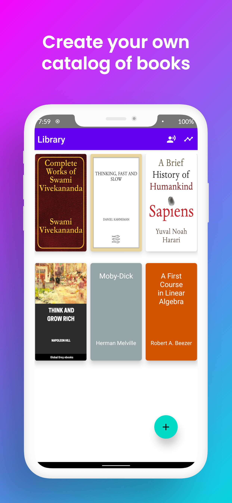
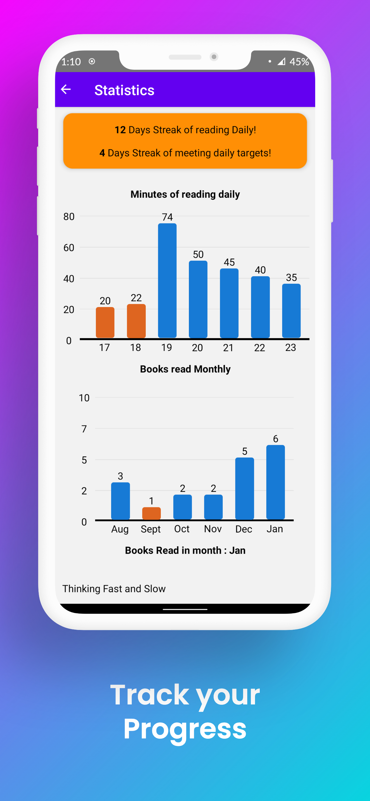
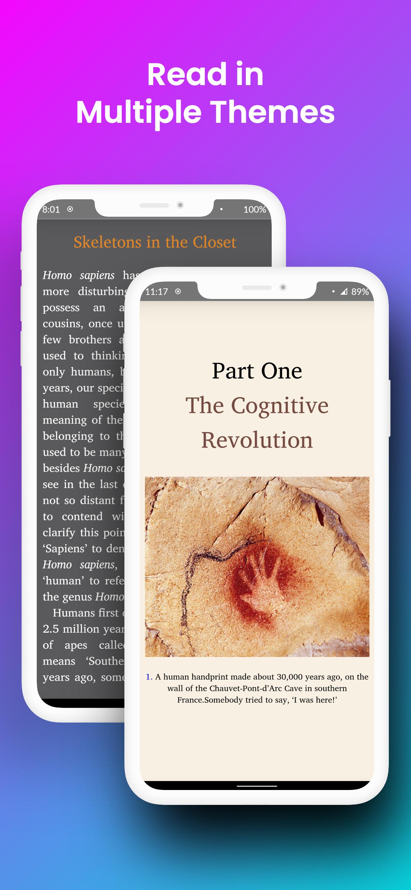
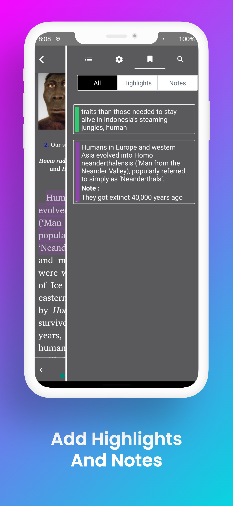

# Immersion Reader

This is a react-native app designed to read and listen to ebooks
It works on both ios and android

## Features
* Themes
* Contents Scrolling
* Font size and line spacing
* Highlighting and note-taking
* Progress Tracker to habitualise reading

# Screenshots

